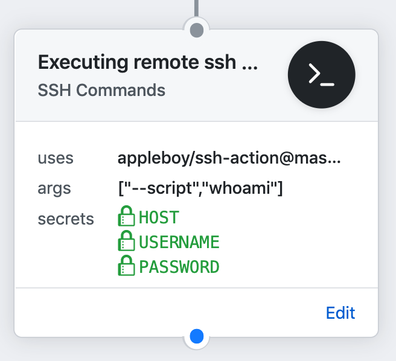
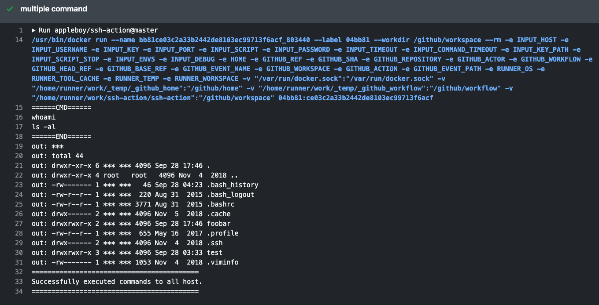

# 🚀 SSH for GitHub Actions

[GitHub Action](https://github.com/features/actions) for executing remote ssh commands.



[](https://github.com/appleboy/ssh-action/actions)

## Usage

Executing remote ssh commands.

```yaml
name: remote ssh command
on: [push]
jobs:

  build:
    name: Build
    runs-on: ubuntu-latest
    steps:
    - name: executing remote ssh commands using password
      uses: appleboy/ssh-action@master
      with:
        host: ${{ secrets.HOST }}
        username: ${{ secrets.USERNAME }}
        password: ${{ secrets.PASSWORD }}
        port: ${{ secrets.PORT }}
        script: whoami
```

output:

```sh
======CMD======
whoami
======END======
out: ***
==========================================
Successfully executed commands to all host.
==========================================
```

## Input variables

see the [action.yml](./action.yml) file for more detail imformation.

* host - scp remote host
* port - scp remote port
* username - scp username
* password - scp password
* timeout - timeout for ssh to remote host, default is `30s`
* command_timeout - timeout for scp command, default is `1m`
* key - content of ssh private key. ex raw content of ~/.ssh/id_rsa
* key_path - path of ssh private key
* script - execute commands
* script_stop - stop script after first failure
* envs - pass environment variable to shell script
* debug - enable debug mode

### Example

Executing remote ssh commands using password.

```yaml
- name: executing remote ssh commands using password
  uses: appleboy/ssh-action@master
  with:
    host: ${{ secrets.HOST }}
    username: ${{ secrets.USERNAME }}
    password: ${{ secrets.PASSWORD }}
    port: ${{ secrets.PORT }}
    script: whoami
```

Using private key

```yaml
- name: executing remote ssh commands using ssh key
  uses: appleboy/ssh-action@master
  with:
    host: ${{ secrets.HOST }}
    username: ${{ secrets.USERNAME }}
    key: ${{ secrets.KEY }}
    port: ${{ secrets.PORT }}
    script: whoami
```

Multiple Commands

```yaml
- name: multiple command
  uses: appleboy/ssh-action@master
  with:
    host: ${{ secrets.HOST }}
    username: ${{ secrets.USERNAME }}
    key: ${{ secrets.KEY }}
    port: ${{ secrets.PORT }}
    script: |
      whoami
      ls -al
```



Multiple Hosts

```diff
  uses: appleboy/ssh-action@master
  with:
-   host: "foo.com"
+   host: "foo.com,bar.com"
    username: ${{ secrets.USERNAME }}
    key: ${{ secrets.KEY }}
    port: ${{ secrets.PORT }}
    script: |
      whoami
      ls -al
```

Pass environment variable to shell script

```diff
  uses: appleboy/ssh-action@master
+ env:
+   FOO: "BAR"
  with:
    host: ${{ secrets.HOST }}
    username: ${{ secrets.USERNAME }}
    key: ${{ secrets.KEY }}
    port: ${{ secrets.PORT }}
+   envs: FOO
    script: |
      echo "I am $FOO"
      echo "I am $BAR"
```

Stop script after first failure. ex: missing `abc` folder

```yaml
- name: stop script if command error
  uses: appleboy/ssh-action@master
  with:
    host: ${{ secrets.HOST }}
    username: ${{ secrets.USERNAME }}
    key: ${{ secrets.KEY }}
    port: ${{ secrets.PORT }}
    script_stop: true
    script: "mkdir abc/def,ls -al"
```
